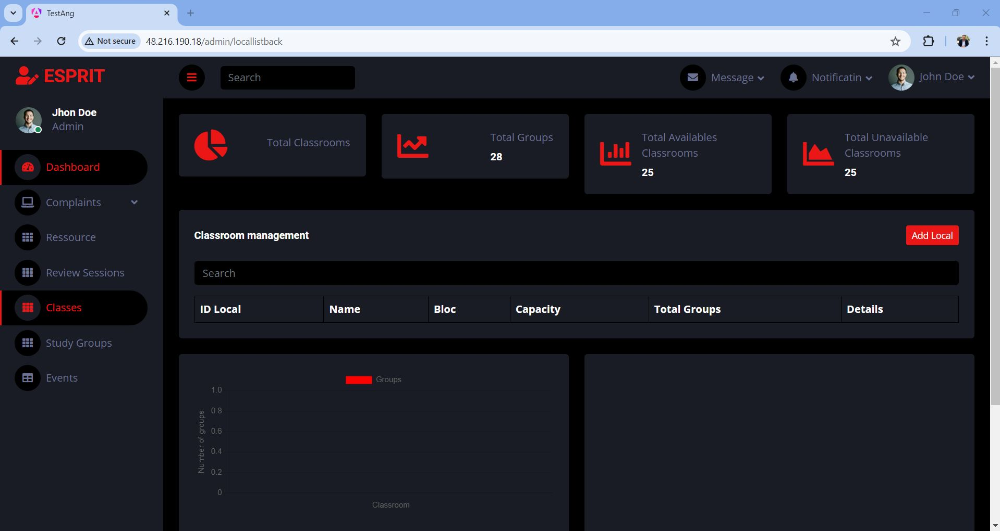
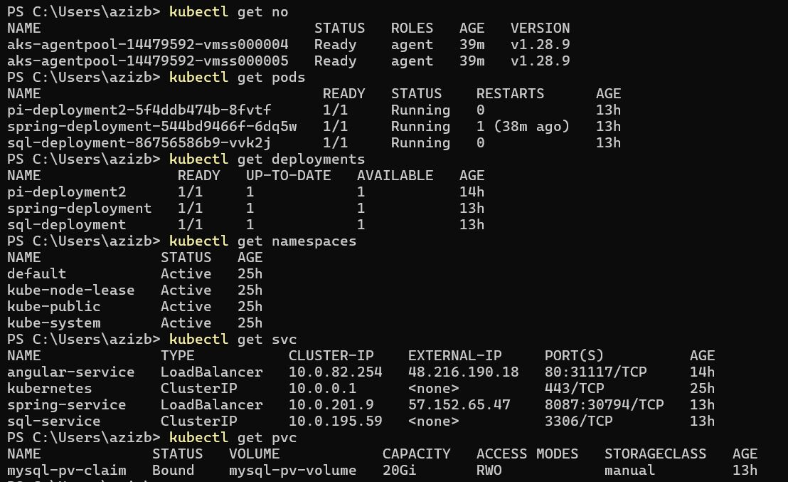
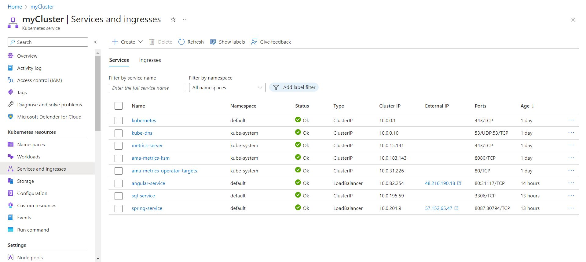
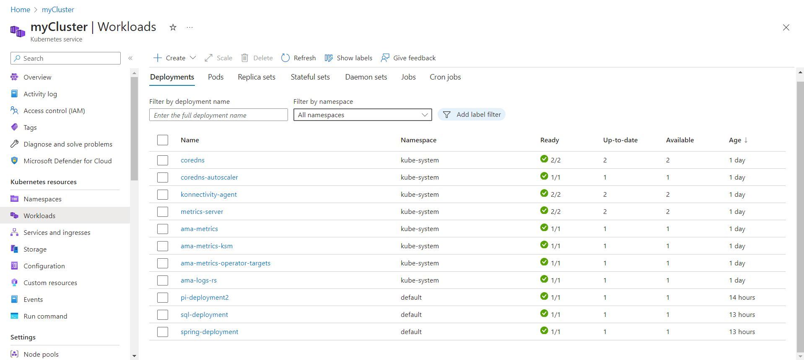
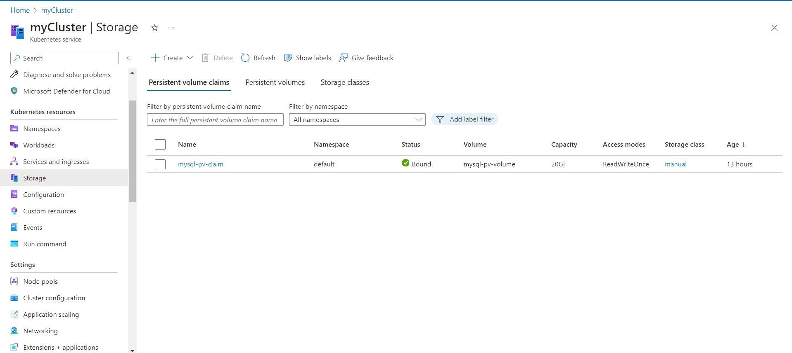
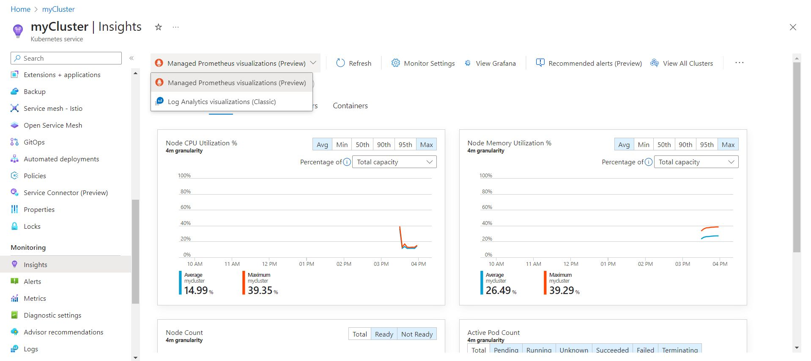
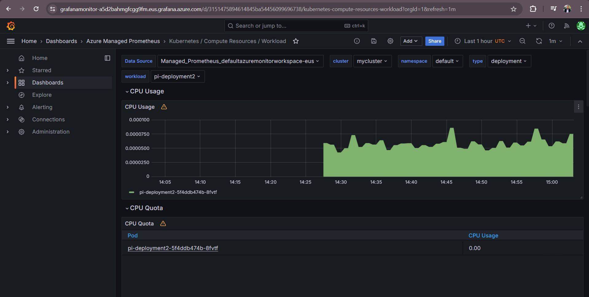

# Study Hub: An Integrated Cloud Solution

Welcome to the **Study Hub** repository, part of the Integrated Project **Sky High Solutions**. This project focuses on developing and deploying an innovative web application to enhance study accessibility, streamline academic activities, and foster collaboration.

---

## 🛠️ Key Features

- **Classroom Reservation:** Simplify study space booking.
- **Resource Sharing Tools:** Exchange study materials effortlessly.
- **Communication Channels:** Connect students and faculty seamlessly.
- **Feedback Mechanisms:** Submit complaints and review sessions.
- **Event Management:** Access events easily via QR codes.
- **Secure Accounts & Notifications:** Prioritize data security and timely updates.

---

## 🧰 Technologies

- **Frontend:** Angular
- **Backend:** Spring Boot
- **Database:** MySQL
- **Containerization:** Docker
- **Orchestration:** Kubernetes on Azure Kubernetes Service (AKS)
- **Monitoring:** Prometheus and Grafana
- **Traffic Management:** Nginx

---

## 🚀 Deployment Highlights

### AKS Deployment
1. Built Docker images for the application components.
2. Deployed using **Azure Kubernetes Service (AKS)**:
   - Pods for isolated instances.
   - Nginx for traffic routing.
   - Kubernetes manifests for frontend-backend-database communication.

### Monitoring
- Integrated **Prometheus** for performance metrics.
- Used **Grafana** for visualizing application health.

---

## 📸 Screenshots

### Study Hub Dashboard

*An intuitive dashboard showcasing Study Hub's user-friendly interface.*

---

### Kubernetes Deployment Overview

*Overview of the AKS cluster deployment, highlighting pods and services.*

---

### Cluster Overview

*Visual representation of the AKS cluster nodes and workloads distribution.*

---

### Services and Ingress

*Details of Kubernetes services and ingress setup for routing and load balancing.*

---

### Workloads Management

*Overview of running workloads, including frontend, backend, and database pods.*

---

### Persistent Storage

*Configuration of persistent storage for ensuring reliable data management.*

---

### Monitoring Insights: Prometheus and Grafana

#### Prometheus Dashboard

*Prometheus dashboard displaying key metrics for application health.*

#### Grafana Insights

*Grafana visualization providing detailed insights into application performance.*

---

---

## 🎯 Objectives Achieved

1. Enhanced accessibility to study spaces and resources.
2. Improved organization in academic activities.
3. Enabled seamless communication and collaboration.

---

## 📈 Personal Growth

This project was a rewarding journey, improving skills in:
- Cloud Computing
- DevOps
- Web Development

---

## 👨‍💻 Team Acknowledgment

A big thank you to my **team members** and **mentors** for their support and guidance. This year has been an incredible learning experience.

---
